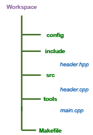

# Plugin Template C++ 

> [!NOTE]
>  This plugin provides a command to generate a simple structure for C++ projects

#### Command
 

 :  **Open VsCode Bar** 

: **To Generate C++ template**

### Structure 

